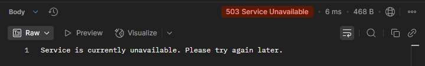
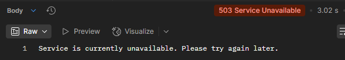

# Different States in the Circuit Breaker Pattern

At any given point of time, a circuit breaker will be in different states like:

**Open**: This states indicates that the Circuit Breaker is open, and all the traffic going through the Circuit Breaker will be blocked.

**Half-Open**: In this state, the Circuit Breaker will start allowing gradually the traffic to the remote service R

**Closed**: In this state, the Circuit Breaker will allow all the requests to the service, which means that the service R is working well without any problems.

Check components status using Actuator: http://localhost:8888/actuator/health

Before product service down:
```"components": {
    "circuitBreakers": {
      "status": "UP",
      "details": {
        "productServiceCircuitBreaker": {
          "status": "UP",
          "details": {
            "failureRate": "-1.0%",
            "failureRateThreshold": "50.0%",
            "slowCallRate": "-1.0%",
            "slowCallRateThreshold": "100.0%",
            "bufferedCalls": 1,
            "slowCalls": 0,
            "slowFailedCalls": 0,
            "failedCalls": 0,
            "notPermittedCalls": 0,
            "state": "CLOSED"
          }
        }
      }
    },
},
```

After 5 failed calls:
```                "productServiceCircuitBreaker": {
                    "status": "CIRCUIT_OPEN",
                    "details": {
                        "failureRate": "100.0%",
                        "failureRateThreshold": "50.0%",
                        "slowCallRate": "0.0%",
                        "slowCallRateThreshold": "100.0%",
                        "bufferedCalls": 5,
                        "slowCalls": 0,
                        "slowFailedCalls": 0,
                        "failedCalls": 5,
                        "notPermittedCalls": 0,
                        "state": "OPEN"
                    }
                }
```

Early fallback response in circuit breaker OPEN state:


After 3 successful calls in HALF_OPEN state:
```
                    "status": "UP",
                    "details": {
                        "failureRate": "-1.0%",
                        "failureRateThreshold": "50.0%",
                        "slowCallRate": "-1.0%",
                        "slowCallRateThreshold": "100.0%",
                        "bufferedCalls": 0,
                        "slowCalls": 0,
                        "slowFailedCalls": 0,
                        "failedCalls": 0,
                        "notPermittedCalls": 0,
                        "state": "CLOSED"
                    }
```

Note: circuit breaker only trigger fallback when there is exception (timeout, connection err,...), not when error code is recieved from remote services.

After adding 5s sleep, early return from circuit breaker 3s timelimiter:

After 5 slow calls:
```
                    "status": "CIRCUIT_OPEN",
                    "details": {
                        "failureRate": "100.0%",
                        "failureRateThreshold": "50.0%",
                        "slowCallRate": "0.0%",
                        "slowCallRateThreshold": "100.0%",
                        "bufferedCalls": 3,
                        "slowCalls": 0,
                        "slowFailedCalls": 0,
                        "failedCalls": 3,
                        "notPermittedCalls": 1, // This call got early fallback
                        "state": "OPEN"
                    }
```