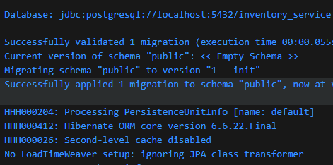

No need init.sql for container startup \
auto create based on POSTGRES_DB: inventory_service \

@Transactional annotation in Spring Boot is used for declarative transaction management. It allows developers to define a transactional scope for a method or a class, ensuring that a series of database operations within that scope are treated as a single, atomic unit.
